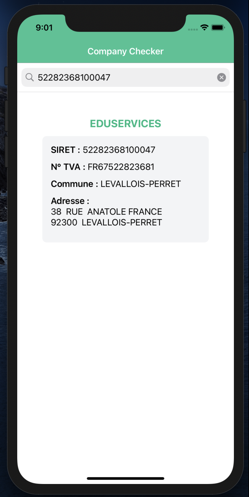
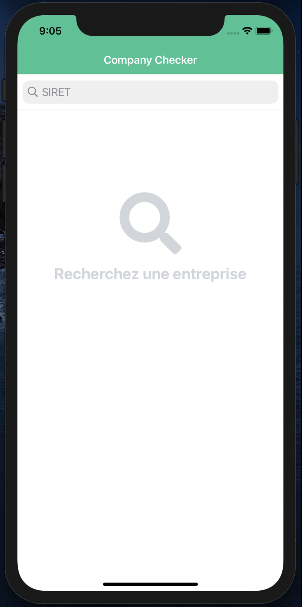
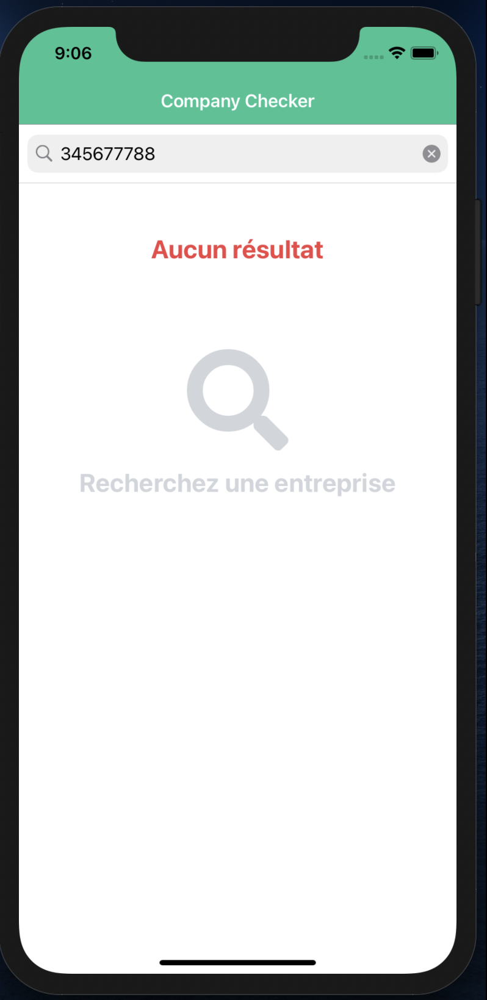

# Contrôle n°1 - Company Checker


**Date :** 16/03/2021


## Objectif

Vous allez devoir développer une application de récupération d'informations de sociétés à partir d'un numéro SIRET ou d'une ville.

Il sera nécessaire d'utiliser l'API Sirene (Open Data), mise à disposition par le Gouvernement à l'adresse suivante :
https://entreprise.data.gouv.fr/api_doc/sirene

**IMPORTANT :** Allez voir la documentation de l'API en vous rendant sur l'URL ci-dessus.


## 1. Installation du projet

### 1.1. Clôner le dépôt Git

Vous pouvez récupérer les sources du projet sur GitHub dans le dépôt : https://github.com/sardoj/CompanyCheckerControle

Vous pouvez simplement exécuter la commande suivante directement depuis votre ordinateur :

`git clone git@github.com:sardoj/CompanyCheckerControle.git`

### 1.2. Installer les dépendances

Une fois les fichiers récupérés, placez-vous à la racine et exécutez la commande suivante pour installer toutes les dépendances :

`npm install`

### 1.3. Exécuter l'application


Pour rappel, les commandes pour exécuter l'application dans un émulateur ou sur votre téléphone sont :

`ns run android ` ou `ns run ios`


## 2. Vos missions

Rendez-vous dans le fichier `src/app/pages/home/home.component.ts`.  La méthode `searchCompany()` permet de faire un appel à l'API pour récupérer les informations de la société dont le numéro SIRET est *52282368100047*, c'est-à-dire Eduservices.

**Mission n°1 :** Faites le nécessaire pour permettre à l'utilisateur de pouvoir rechercher les informations de n'importe quelle société en saisissant son numéro SIRET. Présentez les informations au plus proche de l'image ci-dessous (on n'est pas au pixel près...)  **(4 points)**

Vous pouvez utiliser une `SearchBar` pour effectuer la recherche.




<u>Astuces (Tailwind CSS):</u>

- Vous pouvez utiliser la classe `bg-green-500` pour mettre le fond en vert.
- Vous pouvez utiliser la classe `text-green-500` pour mettre le texte en vert.


**Mission n°2 :** Factorisez le code en créant le service `ApiService` dans le fichier `src/app/services/api.service.ts`. **(3 points)**

```typescript
// src/app/services/api.service.ts

import { HttpClient } from '@angular/common/http';
import { Injectable } from '@angular/core';

@Injectable({
  providedIn: 'root'
})
export class ApiService {

    private endpointUrl:string = "https://entreprise.data.gouv.fr/api/sirene/v3";

    constructor(private http: HttpClient) { }

    // A compléter
}
```


**Mission n°3 :** Factorisez encore plus le code en créant le repository `EstablishmentRepository` dans le fichier `src/app/repositories/establishment.service.ts`. Ce repository permet de faire des recherches d'établissements (on pourrait en créer un autre pour faire des recherches d'unités légales). **(2 points)**

```typescript
// src/app/repositories/establishment.service.ts

import { ApiService } from './../services/api.service';
import { Injectable } from '@angular/core';

@Injectable({
  providedIn: 'root'
})
export class EstablishmentRepository {

    constructor(private api:ApiService) { }

    // A compléter
}
```


**Mission n°4 :** Installez la librairie `Font Awesome` et faites en sorte d'obtenir la mise en page ci-dessous. **(2 points)**




Vous pouvez utiliser le code XML ci-dessous :

```xml
<StackLayout class="mt-20 text-center">
  <Label text="&#xf002;" textWrap="true" class="mb-4 text-gray-300 text-8xl fas"></Label>
  <Label text="Recherchez une entreprise" textWrap="true" class="text-2xl font-bold text-gray-300"></Label>
</StackLayout>
```


**Mission n°5 :** Gérez le cas où il n'y a pas de résultat. **(3 points)**

N'affichez le message en respectant les conditions suivantes :

- Le message ne doit pas s'afficher si la recherche n'est pas lancée.
- Le message s'affiche s'il n'y a pas de résultat à la recherche.
- Si on vide le champ de recherche, le message disparaît.




La section `error` du code suivant permet de savoir qu'il n'y a pas de résultat à la recherche :

```typescript
this.establishmentRepository.retrieve(this.siret).subscribe((response) => {
	// ...
},
(error) => {
  if (error.error.message === 'no results found') {
  	// A compléter
  };
});
```


<u>Astuces (Tailwind CSS):</u>

- La classe `text-red-500 ` permet de mettre le texte en rouge.
- La classe `text-2xl` permet d'agrandir la taille du texte.
- La classe `font-bold` permet de mettre le texte en gras.


**Mission n°6 :** Soyez créatif !  **(4 points)**

Vous pouvez améliorer l'UI/UX ou ajouter des fonctionnalités.


**Mission n°7 :** Partagez votre code **(2 points)**

Créez une branche git nommée `controle-` suivi de vos initiales et poussez là sur le dépôt GitHub.

<u>Exemple :</u> Si je m'appelle John DOE, ma branche s'appellera : `controle-jd`.

